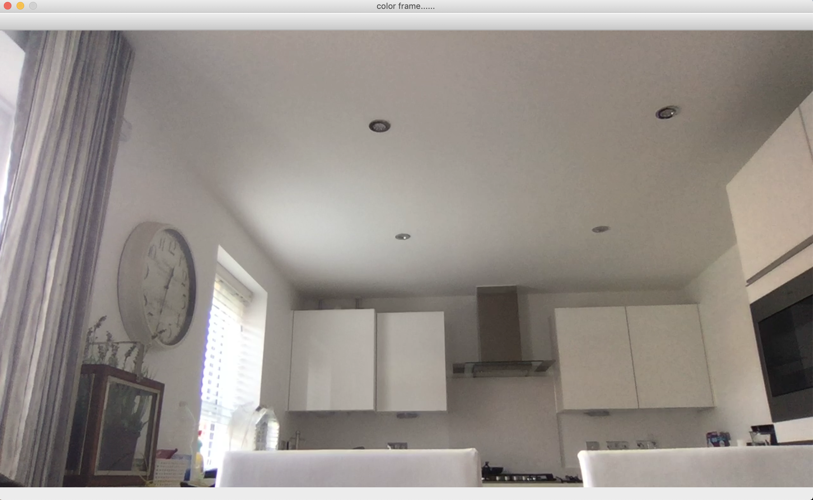

# Webcam-Motion-Detector

This program uses the webcam to detect motion. When the program is ran it takes the first frame from the webcam and keeps comparing rest of the frames with the first one. Thus, while executing the program avoid any sort of movement infront of the webcam for a second or two so the webcam can capture the first frame.

First Frame

When motion detected

